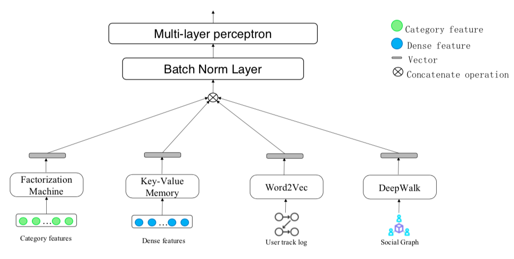
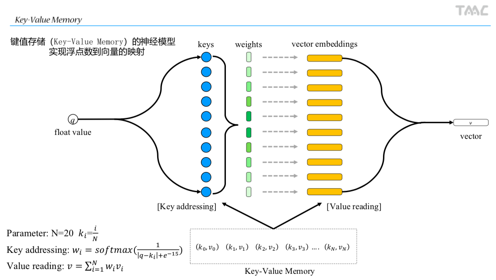

### 1. 题目介绍

请直接查看guide.pdf了解赛题，该项目是初赛第一名的模型。

### 2.模型介绍






### 3. 配置环境

- scikit-learn
- tqdm
- pandas
- numpy
- scipy
- tensorFlow=1.12.0 (其他版本≥1.4且不等于1.5或1.6)
- Linux Ubuntu 16.04, 128G内存(64G应该足够)，一张显卡 

### 4.数据下载
```shell
mkdir data 
cd data
#Download data from https://pan.baidu.com/s/1ASQMms_u70psRgW_KEyT2Q 
#Password: burw
unzip algo.qq.com_641013010_testa.zip imps_log.zip user.zip
cd ..
```

### 5.数据预处理

```shell
python src/preprocess.py
```

### 6.提取特征

```shell
python src/extract_feature.py
```

### 7.转换数据格式

```shell
python src/convert_format.py
```

1）缺失值NA用0填充

2）将Word2Vec和DeepWalk得到的embedding拼接起来，并且掩盖到5%的广告

3）将需要用key-values的稠密特征正则化到[0,1]之间

### 8.训练模型

```shell
mkdir submission
python train.py
```

